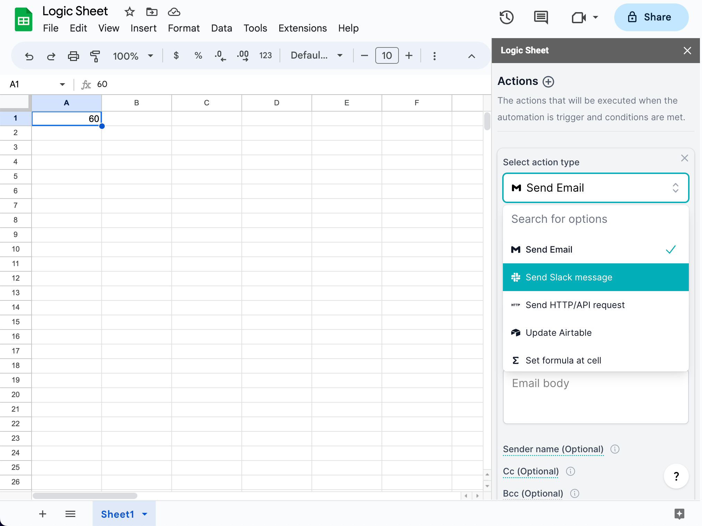

# Actions

Once an automation is triggered and the conditions are met, Logic Sheet will run actions that you have set in this step.


You need at least one action to make a complete automation. If no action is set, the automation will not run.


### Add an action

<figure><figcaption></figcaption></figure>

Currently, we support the following types of actions.

-   [Send an email](send-an-email.md): Send an email from your Gmail account.
-   [Send a Slack message](send-a-slack-message.md): Send a message to a specific channel in the Slack workspace you have authorized to.
-   [Update Airtable](update-airtable.md): Updates a table in your Airtable account automatically.
-   [Recalculate the current sheet](recalculate-the-current-sheet.md): Hard refresh the worksheet you chose in the trigger step and refresh the results of formulas set in the worksheet.
-   [Make an HTTP request](make-http-request.md): Send an HTTP request automatically.
-   Set formula at cell
-   Set value at cell/Update a cell's value
-   Grant or remove access to/from a spreadsheet
-   Insert a new sheet to the current spreadsheet
-   Remove duplicates in a chosen sheet
-   Remove rows
-   Remove last rows
-   More to come...

### Remove an action

Click the close button on the top right of each action form to remove an action.

### Action run sequence

Actions will run sequentially if you choose multiple actions.
