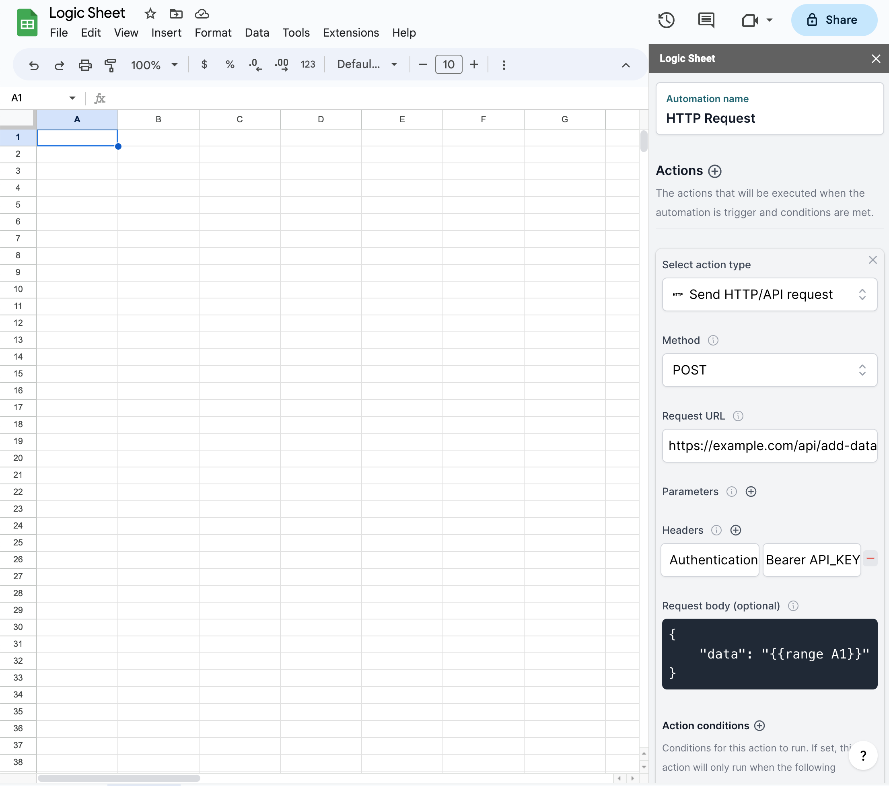
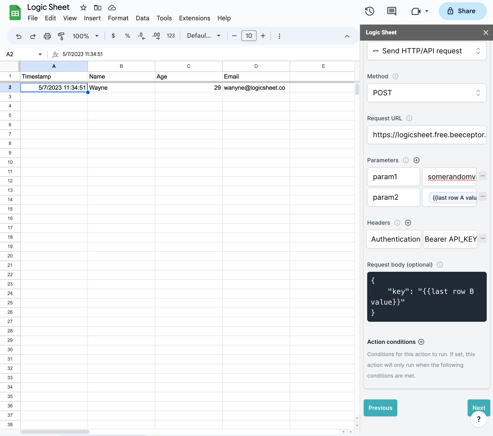
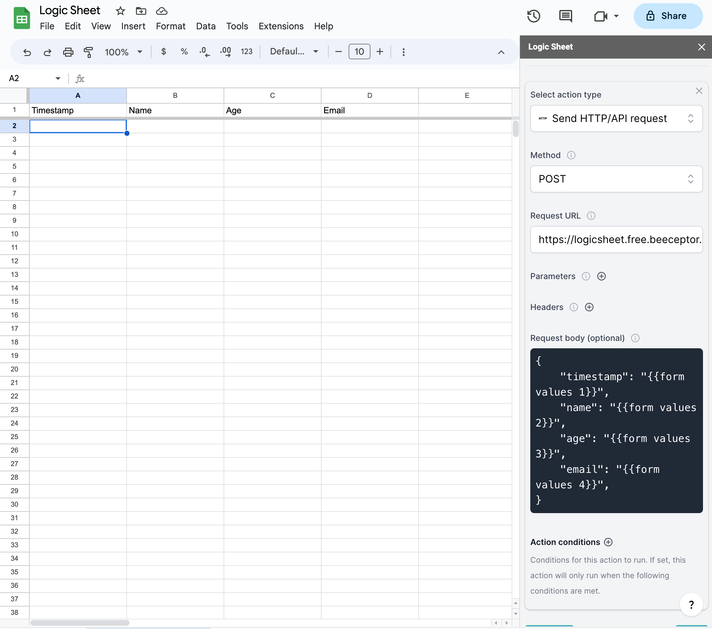
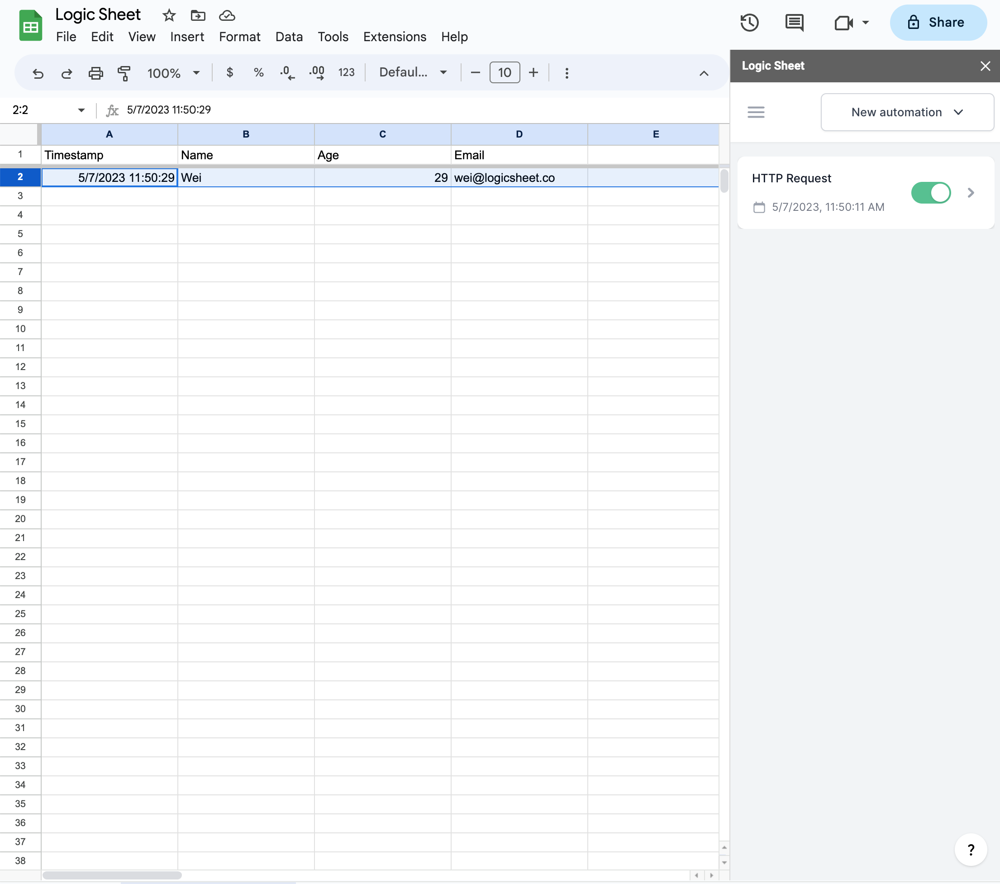
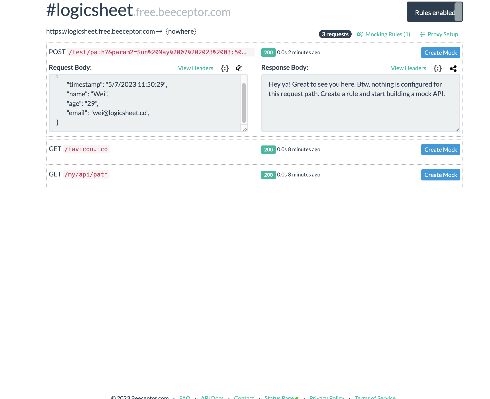

# Make HTTP request

The HTTP request action allows you to make an HTTP/API request to a service/endpoint once the workflow is triggered and all conditions are met.

<figure><figcaption>
Automatically send an HTTP request from Google Sheets
</figcaption></figure>



#### Merge tag available

You can use merge tags in any fields in the HTTP request form to refer to dynamic data in your spreadsheet. See how to use [merge tags](../merge-tags.md) here.


In the following example, we will go through how to make a POST request and test it.

First, choose an HTTP method and fill in the URL. In this example, we chose the POST method.

Optionally, you can add request parameters to the request.

<figure><figcaption></figcaption></figure>

You can add parameters and headers to the request. In the above example, we used the merge tag `{{last row A value}}` in the parameter "param1", which will be transformed into the real value in the target sheet.

### Example

Now let's try the action with a real-world example. Say we have a Google form linked with a spreadsheet and every time a form response is received, we want to send the form data to an API endpoint.

Here are the questions in the Form.

&#x20;

<figure><figcaption></figcaption></figure>

And here is how the spreadsheet receiving form requests is set up.

<figure><figcaption></figcaption></figure>

Let's make a new automation in Logic Sheet.

In the trigger step, choose the "A form response is received" trigger, and, in this example, choose "Form Responses 1" as the sheet.

We will set no conditions in the example. But if you want to, check the [conditions](../conditions.md) help article.

In the action step, add a new action and choose the "Send HTTP/API request" action.

In this example, we will use the Beeceptor mock API. Requests sent to the mock API endpoint will be logged in Beeceptor's backend.

We will set no parameters and headers in this example, but use the request body to send the form data to the API.

In the JSON request body, we will use merge tags like this:

<figure><figcaption></figcaption></figure>

In the JSON request body, we used merge tags to indicate the upcoming form response values. `{{form response 1}}` is the first value of the form response we receive, thus it is the timestamp. The same applies to other values.

Now we can save the automation and submit a form response.

<figure><figcaption></figcaption></figure>

Once the form is submitted, the values will be added to the spreadsheet.

<figure><figcaption></figcaption></figure>

And on Beeceptor's backend, we can see that the form values are passed through.

<figure><figcaption>
Sending form values to API
</figcaption></figure>
