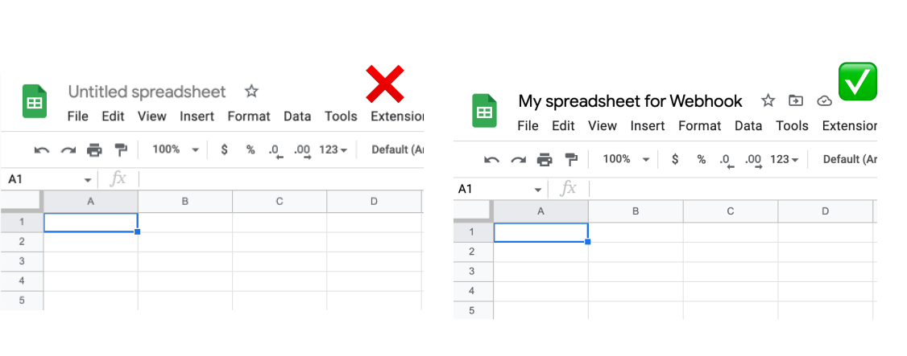

# Webhook

The webhook integration turns your Google Sheets into a webhook so that you can receive data sent to the webhook and trigger automations in Logic Sheet.

### Prerequisites

Before you can create a webhook, you need to do the following steps.

#### 1. Enable the Google Apps Script API in one click

In order to create a webhook for you, Logic Sheet needs to create a Google Apps Script project for you and deploy it as a web app. To do that, we need you to enable the Google Apps Script API in your Google account. The step is effortless to complete and once you have made the change you won't be asked to do so again going forward.

Just open this [link](https://script.google.com/home/usersettings) and enable the Google Apps Script API if it is not already enabled.

<figure><figcaption>
How to enable Google Apps Script API
</figcaption></figure>

#### 2. Rename your spreadsheet if it is an "Untitled spreadsheet"

Logic Sheet cannot create a Google Apps Script project for the webhook if your spreadsheet is named "Untitled spreadsheet", because these kinds of spreadsheets are not saved in Google Drive.

In order to solve this problem, all you have to do is to rename the spreadsheet to anything other than "Untitled spreadsheet."

<figure><figcaption>
Rename your spreadsheet
</figcaption></figure>

### Creating webhook

To get started, click the Integration option from the add-on menu or the hamburger menu in your Logic Sheet sidebar.

<figure><figcaption>
Create a webhook in Google Sheets using Logic Sheet
</figcaption></figure>

Before you create a webhook, you need to choose two options.

**Force 200 OK response code:** By default, the webhook will respond with a JSON response body and a 302 Found code. In some cases, the POST request may return a 405 Method Not Allowed code, even though the requested data will be inserted in your Google Sheets successfully. This may cause some trouble when your webhook sender requires a 200 OK response code to count the request as being successful.&#x20;

If this option is checked, all successful requests will return a 200 OK response code. The only drawback is the response body will be in HTML format, rather than JSON format.

It is recommended to keep this option checked.

**Include a timestamp column:** Choose whether to insert a timestamp column at the beginning of the sheet indicating when the data is received. If enabled, you will see the timestamp column like the following.

<figure><figcaption></figcaption></figure>

Make sure that you have enabled the Google Apps Script API and have renamed your spreadsheet into anything other than "Untitled spreadsheet," so that you can successfully create a webhook.

### Authorizing your webhook

If your webhook is created successfully, you will see the following screen.&#x20;

<figure><figcaption></figcaption></figure>

The next step is to authorize your webhook. It is an easy 2-step process.

1. Reload the current spreadsheet in your browser.
2. Choose the **Webhooks** menu in your Google Sheets and click Authorize. Once this step is completed, choose the "🔄 Integrations" menu from the Logic Sheet menu and you will see details of your webhook.

<figure><figcaption></figcaption></figure>

#### Seeing a "Google hasn't verified this app" page?

When you authorize your webhook for the first time, you may see a warning from Google saying that Google hasn't verified this app. Don't worry, this is because the webhook functionality requires us to deploy a Google Apps Script project on your behalf, and you are essentially authorizing the project under your own account to access your spreadsheets data.

To complete the authorization if you see this page, click on the **"Advance"** option on the page, and click **"Go to Webhook for Sheets (unsafe)."** Then you will see a page asking you to allow the project to access and edit your spreadsheets data.

<figure><figcaption></figcaption></figure>

Still not sure? No problem. The code used in the project is open source and you can check the [source code](https://github.com/choraria/google-apps-script/tree/master/Sheets/Webhooks) here. All the project does is receiving data from the webhook that was deployed and inserting it into the Google Sheets you have specified. No other parties can see your data as you only authorized a project owned by you to access your data.

### Get your webhook details

Once you have completed the authorization process, open the Integrations option from Logic Sheet's add-on menu. You will be able to see your webhook details.

<figure><figcaption>
Webhook details for Google Sheets
</figcaption></figure>

By default, data received by the webhook goes into the first sheet of the current spreadsheet. To change the destination of webhook data, please select a different sheet from the dropdown select.

Note that each time you change the destination sheet, the gid parameter in the webhook URL will change accordingly. The gid parameter is essential for the webhook to function. You can change the value of the gid parameter to the id of any other worksheet in your spreadsheet.


You should use a completely empty worksheet as the destination sheet.


### Making a request

The webhook accepts both GET and POST methods. For the GET method, data to be passed into the Google Sheets should be included in the query parameters. For the POST method, data should be included in the JSON request body.

#### GET request

Here is how to send values including Name, Age, and Email to a Google spreadsheet using webhook.

<figure><figcaption>
Sending data to Google Sheets using Logic Sheet webhook
</figcaption></figure>

And data is received in Google Sheets and inserted into the destination worksheet.

<figure><figcaption>
Sending data to Google Sheets using Logic Sheet webhook
</figcaption></figure>

#### POST request

You should keep the gid parameter even if you use the POST method.&#x20;

<figure><figcaption>
Google Sheets POST request
</figcaption></figure>

Then in the request body, present your data in JSON format.

<figure><figcaption>
Google Sheets POST request
</figcaption></figure>

And the data will be added to the destination sheet.

<figure><figcaption>
Google Sheets POST request
</figcaption></figure>
