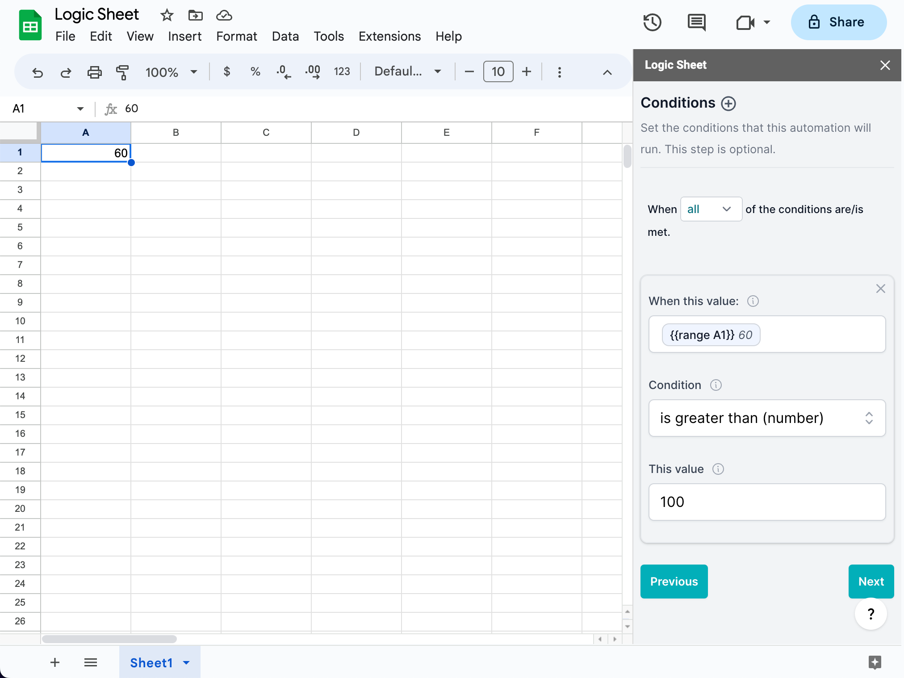

# Conditions

This is an optional step that lets you set up a set of conditions to decide whether a workflow should be executed. You can use conditions to fine-control an automated workflow, for example, only run the automation when range A5 is larger than 100.

Conditions are optional. You can skip this step by not adding any conditions in this step. Remember to remove all added conditions if you don't intend to use any conditions.

<figure><figcaption></figcaption></figure>

Once you have added one condition, you will see an option that lets you choose "When all/any of the conditions are/is met." If you choose "all," the automation will only run if all of the conditions you have set are met. If you choose "any," the automation will run if at least one of the conditions you have set is met.

#### When this value

In this field, you can type in the value that you want to compare. Usually, you will need to use a [merge tag](merge-tags.md) to refer to the dynamic data in your spreadsheet or in the context of an automation run. For example, `{{Range A1}}` will give you the value of cell A1. If you are using an edit trigger, `{{new value}}` will give you the new value when a cell is edited.

#### Condition

The Condition dropdown menu here refers to the operator of the comparison you want to make. Here are all the operators you can choose:

-   is equal to
-   is not equal to
-   is greater than (numbers)
-   is greater than or equal to (numbers)
-   is less than (numbers)
-   is less than or equal to (numbers)
-   contains
-   does not contain
-   is empty
-   is not empty

#### Value

The value to compare to. The following configuration will let the automation run only when cell A1 is greater than 100.

<figure><figcaption></figcaption></figure>


**Heads up (if you used Logic Sheet before January 2023)!** We have improved the condition form. Now, you can compare two values directly instead of comparing the cell value to a specific value as before. To check if the value in cell A3 is equal to 10, simply enter \{{Range A3\}} in the first input and 10 in the "This value" input. In the edit trigger, to check if the edited range meets certain conditions, use the \{{New value\}} merge tag instead of the \{{edited range\}} tag.

