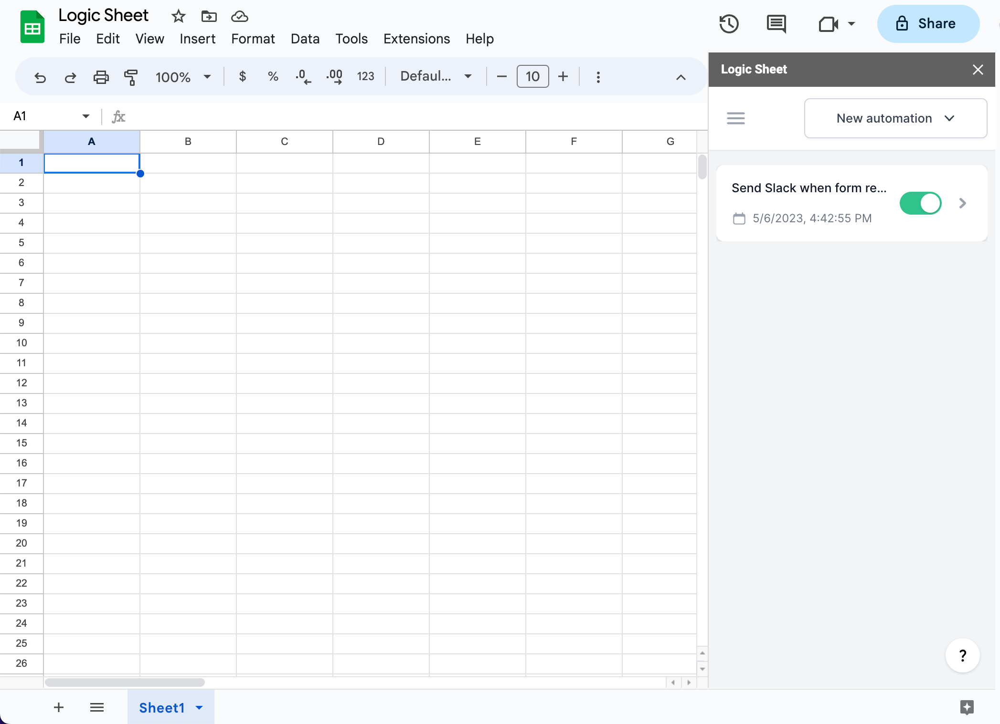

# Automation overview

Use Logic Sheet Automation to automate your Google Sheets tasks.&#x20;

With Logic Sheet, you can set up triggers that initiate specific actions upon certain events, such as when a cell is edited or a form is submitted, or at a specific time.&#x20;

To create an automation workflow in Logic Sheet, you will need to establish a trigger, optional conditions, and at least one action.&#x20;

All of your automations for a single document can be accessed and managed from add-on sidebar.

To turn an automation on or off, click the toggle bar next to the automation.&#x20;

To delete an automation, hover over the menu button and select "Delete." Confirm the deletion in the pop-up prompt, and the automation will be removed.&#x20;

To add a new automation, click the "New automation" button and use the automation builder to set up the trigger, conditions, and actions. It is good practice to change the name of your automation workflow as soon as you open the automation builder.

To make an automation workflow, you need to go through [Trigger](trigger.md), [Conditions](conditions.md), and [Actions](actions/).

### [Trigger](trigger.md)

A trigger is the event that fires up the automation workflow. In Logic Sheet, you can set up the following triggers:

-   Run at a specific time
-   Run every hour, every day, every week, or every month
-   When a [webhook](add-connections/webhook.md) is received
-   When a Google Forms response is received
-   When a new row/column is inserted

### [Conditions (optional)](conditions.md)

Conditions allow you to specify additional criteria that must be met in order for the automation workflow to run. For example, you can set up a condition to only run the automation if the value of a specific cell meets a certain criterion.

### [Actions](actions/)

An action is the task that will be performed when the automation workflow is triggered. Here are some actions you can use in Logic Sheet.

-   Send an email: This action will send an email with specified content and recipients
-   Update cell value: This action will update the value of a specific cell in the spreadsheet
-   Create a new row: This action will add a new row to the spreadsheet with specified values
-   Send a Slack message to a specified channel
-   Append a new row in Airtable
-   Remove duplicates
-   Remove rows in a sheet
-   Set formula at a cell
-   Refresh formulas in a sheet
-   Send an HTTP/API request to a service
-   See more action on the [Actions](actions/) page
