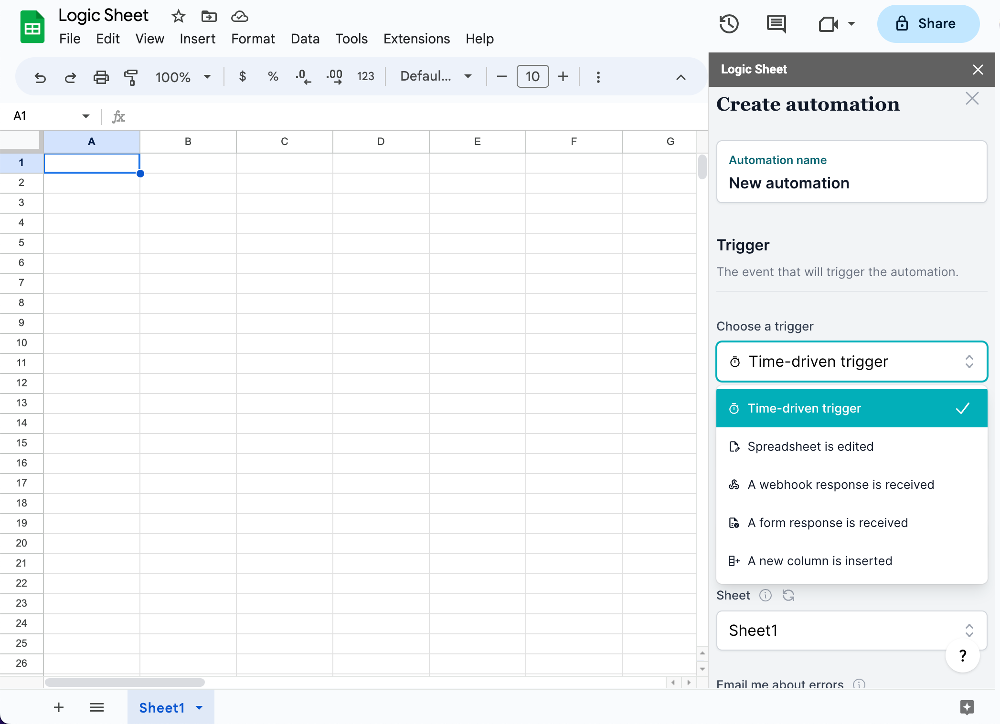

# Trigger

In Logic Sheet, you can set up triggers to initiate automation workflows based on specific events or times. Currently, we support the following triggers:

-   At a specific time
-   Every hour, day, week, or month
-   When the spreadsheet is edited
-   When a Google Form is received
-   When you receive a webhook response
-   When a new row is inserted

### Choose a trigger type

<figure><figcaption></figcaption></figure>

**Time-driven trigger** runs at a specified time. It can run once or run recursively, like every hour, every day, every week, or every month.

The **Spreadsheet is edited** trigger runs when a spreadsheet is manually edited.

A **Webhook** trigger runs when you have set up a [webhook](./add-connections//webhook.md) using Logic Sheet and a webhook response is received.

A **form response received** trigger runs when you have connected your spreadsheet with a Google From and a form response is received.


Currently, you can only set up one automation with each one of the above-mentioned three types of triggers. For example, if you have created a "Spreadsheet is edited" trigger, which is a type of "On edit trigger" in one spreadsheet, you cannot create another on edit trigger. You may see the following error message if you create more than one triggers with the same type.

_`An error happened. Error message: Exception: This add-on has created too many time-based triggers in this document for this Google user account.`_

A possible solution to this limit is our [Conditional action](actions/conditional-actions.md) feature.&#x20;


### Sheet

In the trigger step, you will be asked to choose a sheet (or worksheet) for the automation.&#x20;

In most cases, this option will affect how the [conditions](conditions.md) you set to run the automation. For example, in the [conditions step](conditions.md), if you choose a range condition and set the range as "A1," the app will look up the A1 range in the worksheet you have chosen in the trigger step.


If your trigger type is "A form response is received," you have to set the sheet here as the worksheet that is receiving form responses.

