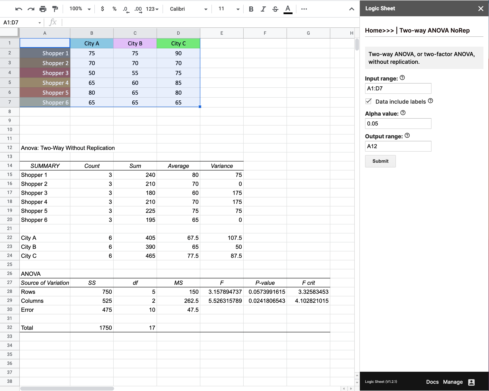

# Data analysis

Logic Sheet can be used to perform all kinds of data analysis tasks, including ANOVA, or Analysis of variance, correlation, covariance, and descriptive statistics.

### One-way ANOVA

One-way ANOVA, or single-factor ANOVA, is used to determine whether there are any statistically significant differences between the means of several unrelated groups.

<figure><figcaption></figcaption></figure>

**Input range:** Select the input range of your data. A range represents a single cell or a group of adjacent cells in your spreadsheet. For example, A1:D10 is shown below.

<figure><figcaption></figcaption></figure>

**Grouped by:** Choose how the data is grouped, it can either be in columns or in rows.

**Data include labels:** Check this if the input range you have selected includes data labels. Please make sure you don’t include non-numeric cells if you uncheck this box.

**Alpha value:** Alpha(α), or the significance level, is the probability of rejecting the null hypothesis when it is true. For example, an alpha value of 0.05 means that a 5% risk of concluding that a difference exists when there is no actual difference. In ANOVA, the alpha value is used to calculate the F crit value in the output.

**Output range:** Set the _cell range_ from which the ANOVA table will be displayed. Make sure there is enough space for output data. For example: A12. The output will take at least 15 rows and 7 columns. It could be larger depending on the size of the input. (See example above)

### Two-way ANOVA without replication

Two-way ANOVA, or two-factor ANOVA, is used to analyze the difference between the means of more than two groups. It is also used to estimate how two independent variables, in combination, affect a dependent variable.

<figure><figcaption></figcaption></figure>

**Input range:** Select the input range of your data. A range represents a single cell or a group of adjacent cells in your spreadsheet. For example, A1:D10 is shown below.

<figure><figcaption></figcaption></figure>

**Grouped by:** Choose how the data is grouped, it can either be in columns or in rows.

**Data include labels:** Check this if the input range you have selected includes data labels. Please make sure you don’t include non-numeric cells if you uncheck this box.

**Alpha value:** Alpha(α), or the significance level, is the probability of rejecting the null hypothesis when it is true. For example, an alpha value of 0.05 means that a 5% risk of concluding that a difference exists when there is no actual difference. In ANOVA, the alpha value is used to calculate the F crit value in the output.

**Output range:** Set the _cell range_ from which the ANOVA table will be displayed. Make sure there is enough space for output data. For example: A12. The output will take at least 17 rows and 7 columns. It could be larger depending on the size of the input. (See example above)

### Correlation

Correlation is used to find the correlation coefficient between two or more variables.

<figure><figcaption></figcaption></figure>

**Input range:** Select the input range of your data. A range represents a single cell or a group of adjacent cells in your spreadsheet. For example, A1:D10 is shown below.

<figure><figcaption></figcaption></figure>

**Grouped by:** Choose how the data is grouped, it can either be in columns or in rows.

**Data include labels:** Check this if the input range you have selected includes data labels. Please make sure you don’t include non-numeric cells if you uncheck this box.

**Output range:** Set the _cell range_ from which the correlation results will be displayed. Make sure there is enough space for output data. For example: A12. The output will take at least 3 rows and 3 columns. It could be larger depending on the size of the input. (See example above)

### Covariance

The Covariance tool quantifies the relationship between two sets of values.

<figure><figcaption></figcaption></figure>

**Input range:** Select the input range of your data. A range represents a single cell or a group of adjacent cells in your spreadsheet. For example, A1:D10 is shown below.

<figure><figcaption></figcaption></figure>

**Grouped by:** Choose how the data is grouped, it can either be in columns or in rows.

**Data include labels:** Check this if the input range you have selected includes data labels. Please make sure you don’t include non-numeric cells if you uncheck this box.

**Output range:** Set the _cell range_ from which the covariance results will be displayed. Make sure there is enough space for output data. For example: A12. The output will take at least 3 rows and 3 columns. It could be larger depending on the size of the input. (See example above)

### Descriptive statistics

Descriptive statistics describe the basic features of the data. Features include Mean, Standard Error, Median, Mode, Standard Deviation, Sample Variance, Kurtosis, Skewness, Range, Confidence Level, and more.

<figure><figcaption></figcaption></figure>

**Input range:** Select the input range of your data. A range represents a single cell or a group of adjacent cells in your spreadsheet. For example, A1:D10 is shown below.

<figure><figcaption></figcaption></figure>

**Grouped by:** Choose how the data is grouped, it can either be in columns or in rows.

**Data include labels:** Check this if the input range you have selected includes data labels. Please make sure you don’t include non-numeric cells if you uncheck this box.

**Output range:** Set the _cell range_ from which the covariance results will be displayed. Make sure there is enough space for output data. For example: A12. The output will take at least 18 rows and 2 columns. It could be larger depending on the size of the input. (See example above)

**Kth Largest:** Returns the k’th largest number in the given group of numbers. For example, if the group of numbers are \[7, 10, 4, 3, 20, 15], and when Kth Largest = 3, the output will be 10.

**Kth Largest:** Returns the k’th smallest number in the given group of numbers. For example, if the group of numbers are \[7, 10, 4, 3, 20, 15], and when Kth Largest = 3, the output will be 7.

**Confidence Level for Mean:** The confidence level represents the theoretical long-run frequency (i.e., the proportion) of confidence intervals that contain the true value of the unknown population parameter. For example, 90% of confidence intervals computed at the 90% confidence level contain the parameter, 95% of confidence intervals computed at the 95% confidence level contain the parameter. The confidence level is selected before examining the data. Most commonly, a 95% confidence level is used.
