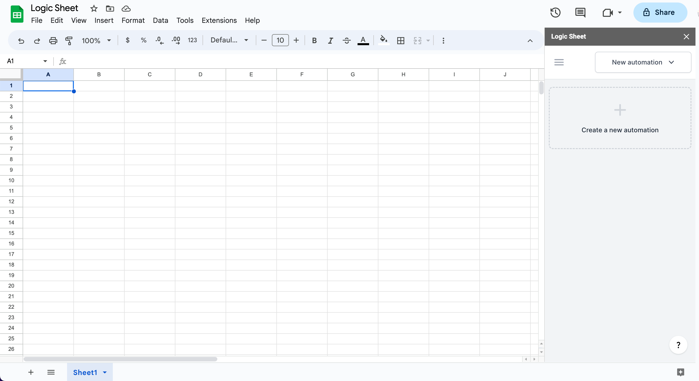

# How to install Logic Sheet

### Overview 

Logic Sheet is an add-on for Google Sheets. You can install Logic Sheet from the Google Workspace Marketplace and open it from the Add-on menu at the top menu of your Google Sheets.

If you already know how to install and use Google Sheets add-ons, you can simply [click here to install Logic Sheet](https://workspace.google.com/marketplace/app/logic_sheet_data_processing_data_analysi/796322869198) and skip the following tutorial.

### Getting started 

Open a spreadsheet in Google Sheets, find the Add-on menu at the top menu.

<figure><figcaption></figcaption></figure>

Click “Get add-ons” and open the Google Workspace Marketplace. In the search bar, input “Logic Sheet” and hit search. Select Logic Sheet from the search result.

<figure><figcaption></figcaption></figure>

Before installing Logic Sheet, you will be asked to grant the add-on certain permissions to access part of your Google account. These permissions include the ability to edit, create, and delete spreadsheets, connect to external services, and send emails on your behalf.

<figure><figcaption></figcaption></figure>

1. See, edit, create, and delete your spreadsheets in Google Drive.
2. Connect to an external service.
3. Display and run third-party web content in prompts and sidebars inside Google applications.
4. Send emails as you.
5. Allow this application to run when you are not present.
6. Create and update Google Apps Script deployments.
7. Create and update Google Apps Script projects.

These permissions are essential for Logic Sheet to perform certain tasks on your behalf. If you have any questions about how we store and use your data, you can refer to our [Privacy Policy](https://logicsheet.co/privacy).

Click Allow to complete the installation.

Now you can find Logic Sheet from the Add-ons menu of Google Sheets’ top menu. Click Start to open Logic Sheet.

<figure><figcaption></figcaption></figure>

Now you can use Logic Sheet in the sidebar on the right of the screen. For details on how to use all of the features, check our [documentation](http://localhost:5000/o/TN1rg5MEBT8G7LFALPxL/s/-MdWK_NNMGxKWvF0J5hL/).

<figure><figcaption>
Logic Sheet sidebar
</figcaption></figure>
